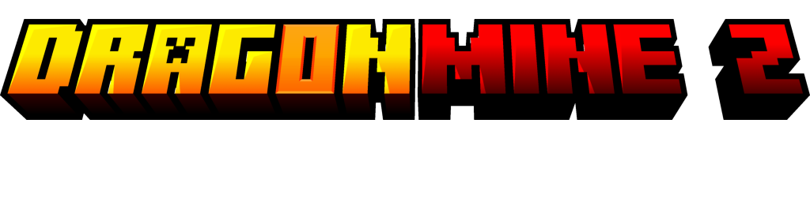

  

## About

DragonMine Z is an immersive WIP (Work-In-Progress) [Minecraft](https://www.minecraft.net/en-us) mod inspired by Akira
Toriyama's most-famous work, [Dragon Ball](https://en.dragon-ball-official.com/).

Our plan is to take the complete Dragon Ball experience into Minecraft **1.20.1**, adding everything we can and
revamping the vanilla experience.

### Contributing

Would you like to help? Cool! Check out the [contribution guide](.github/CONTRIBUTING.md) to start.

    
    
  

## 🚀 Download

To download our mod, visit our official [CurseForge project](https://www.curseforge.com/minecraft/mc-mods/dragonminez),
where the mod is located.

You can also check the project in [Modrinth](https://modrinth.com/mod/dragonminez).

## 🗺️ Roadmap

  

## 🎯 Use of Third Parties

### Sounds

Some sounds are used from the [Zapsplat](https://www.zapsplat.com/) and [Freesound](https://www.zapsplat.com/) pages:

- [Dragon Ball Scouter/Tracker Remade.wav](https://freesound.org/s/518004/) by Pablobd | License: Attribution 3.0
- [A Symphony for Akira Toriyama](https://www.youtube.com/watch?v=xNVEkSerkU0) by GLADIUS | License: CC-BY License

### Acknowledgments

This project includes code from [GeckoLib](https://github.com/bernie-g/geckolib), which is licensed under the MIT
License.
Copyright © 2025 GeckoThePecko. See the `THIRD_PARTY_LICENSES` file for details.

## ✨ Authors

### Developers

- [Yuseix](https://github.com/yuseix300) | *Founder & Programmer*.
- [ezShokkoh](https://github.com/Shokkoh) | *Founder & Programmer*.
- [Bruno](https://github.com/Bruneitor123) | *Community Admin*.

### Contributors

- [Bati2ra](https://github.com/Bati2ra) | *Programmer*
- [KyoSleep](https://github.com/KyoSleep1) | *Programmer*
- JotaJoestar | Modeler and Animator
- Toji71_ | Builder

## License

2025, DragonMine Z. This program is free software: you can redistribute it and/or modify it under the terms of the GNU
General Public License
as published by the Free Software Foundation, either version 3 of the License or (at your option) any later version.
[GNU General Public License v3.0](https://github.com/DragonMineZ/dragonminez/blob/main/LICENSE)
